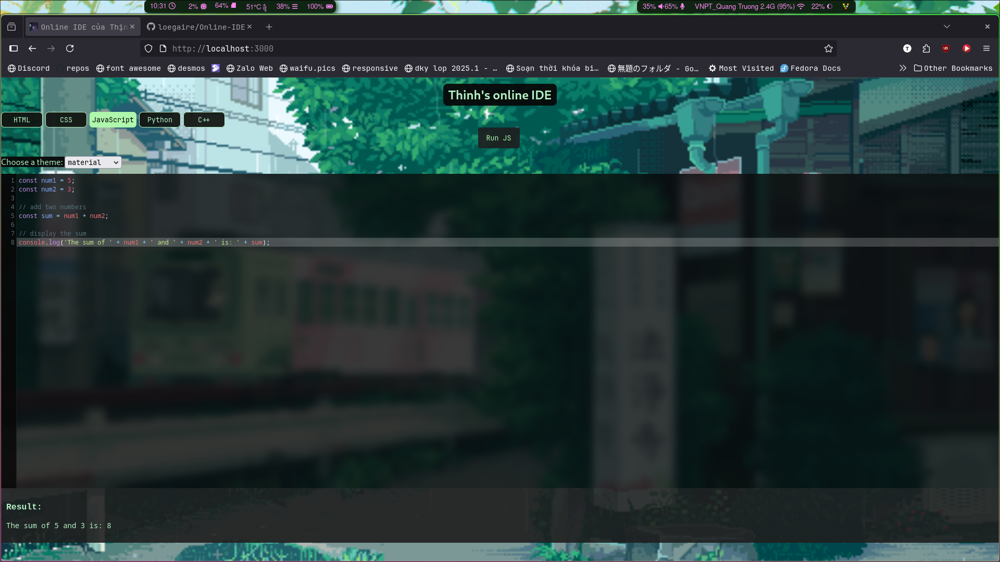

# Online-IDE

An **in-browser Integrated Development Environment** for writing, running, and previewing code, built with a modern web stack. Ideal for students, tinkerers, and anyone who wants a minimal local IDE experience.

---
# How to run it:
Make sure you have `npm` and `node` installed, then clone this repository:
```
git clone https://github.com/loegaire/Online-IDE.git
```
after that, cd into the directory:
```
cd Online-IDE
```
finally run the server with `node`:
```
node server.js
```
Now, use a browser of your choice and visit `http://localhost:3000`, you should see the online IDE rendered.

## Core Mechanics

- Live code editor with instant output and feedback.
- Supports JavaScript, HTML, CSS, Python, C++, and more to come
- Beautiful interface focused on code, result, and learning loop.

---

## Technology Stack

- **Frontend:** React.js with vanilla CSS
- **Backend:** Vanilla Nodejs, Docker, focusing on fine grained control and optimization, applications run inside their seperate Docker containers, ensuring maximum security and compatibility
- **Other Tools:** npm, Fedora Linux for development and management

---

## Screenshot

[Demo: Live Coding and Execution]([https://your-demo-link-2)](https://www.facebook.com/share/v/17HqcPFp6i/)https://www.facebook.com/share/v/17HqcPFp6i/)
---
